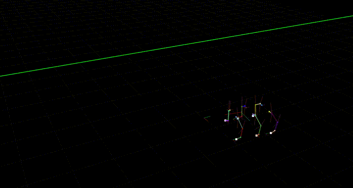
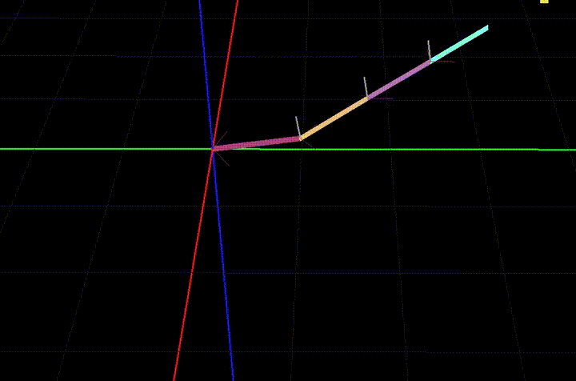
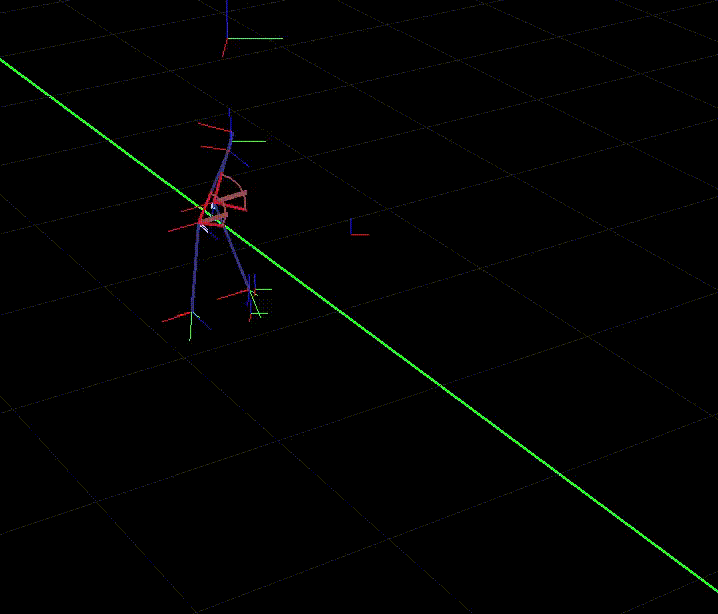
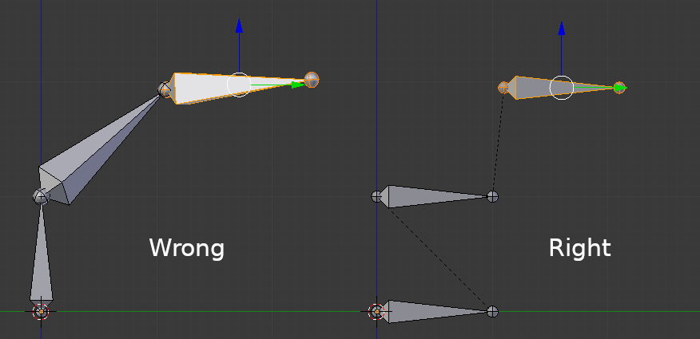

Simple Cyclic Coordinate Decent implementation for Panda3D
===========================================================
Numerical Inverse Kinematics solver with simple constraints



Features:
---------
- Hinge joints
- Ball joints
- Uses Panda3D's Bone system and can be added to an existing, rigged mesh. See usage hints below.
- Pure python, no dependencies beyond Panda3D

Not implemented:
----------------
- Target rotation (only target position is currently taken into account)
- There is currently no way to control the "roll" of a ball joint

Samples:
---------------

### Reacher Sample: ###



The Reacher sample shows how to set up a simple IK chain with constraints which reaches for a moving target point:

```
python3 Samples/ReacherSample.py
```

### Biped Sample: ###



The Biped sample shows a very basic two-legged walking, where the legs are placed by IK. The basic character setup is: The root is a "torso" node. To this, a hip node is rigidly attached. There are two legs, each is its own IKChain. To let the character walk, the torso node is moved, and everything else moves with it.
While the torso moves, the legs have target points on the ground. The IK makes sure that they stay attached to these points, even when the torso moves. Periodically, the legs are moved to a new target to take a step. This new target point is always a point projected onto the floor in front of the body. How often a step is taken and how far infront of the character the new target position is depends on the movement speed of the character.

```
python3 Samples/BipedSample.py
```

Press + and - to speed the character up or slow it down. Note that this is very simplified - in a real example, the time the legs are in the air should increase when running, i.e. the gait should change.

### Tentacle Sample: ###

Shows how a chain can be set up from a existing mesh with bones.

You can switch between ball joints and hinge joints. Note that when using ball joints, the mesh will sometimes get squished together - this happens when a bone rolls (for which there is currently no control in this library).
To avoid this effect, use only hinge joints. Two hinge joints with an offset of zero between them should have a similar effect as a ball joint.

```
python3 Samples/TentacleSample.py
```

### Character Sample: ###

Shows a walking humanoid. Similar to the Biped Sample, but this one uses a mesh, slightly more complicated walking method and can walk up and down slopes.

This is meant as a simple demonstration - there is a lot that can be improved here. Things that could be added:
- Different gait when walking faster
- Different gait when rotating
- Slow down when moving up/down slopes
- The torso is currently always kept a fixed height from the average of the feet positions. This is probably too simple - instead, it could also depend on which foot is grounded and on whether the character is moving up or down.

```
python3 Samples/CharacterSample.py
```

Setup Notes:
------------

There are two ways of setting up a chain - either manually or from an existing rigged model. There are samples for both setups: The ReacherSample and the Biped sample use manual setup, the Tentacle and CharacterRigged samples are set up from a mesh.

### Setting up manually:
The manual case could be used if you want to attach rigid bodies to the segments of an IK chain at runtime. In this mode, you need to set up the Character, add joints to it, add the actor, and then take over control of the joints before you can create the IK chain. Note that most of this is abstracted away by the ArmatureUtils class, although this could also be replaced by your own code. The following steps assume that you use the ArmatureUtils:

- Create an ArmatureUtils instance
- Add all joints to it using the "createJoint" function. Here, you can pass a rotation and/or translation to the joint. This is the base rotation and offset that the joint will have. To make your life simple, it's recommended to _not_ use a rotation here, but you can if you want to.
- Call ArmatureUtils.finalize(). This sets up the Actor for you (which you can retrieve via ArmatureUtils.getActor()) as well as the controlNodes (which you can get via ArmatureUtils.getControlNode()).
- Now you can set up an IKChain. Create an instance, and then add the joints you created to the IKChain using addJoint. Here, for every joint, you can retrieve the controlNode via ArmatureUtils.getControlNode() ).
- At this point, if you want to, you can add constraints to the bones (see below).
- Make sure to reparent the actor which you can retrieve from ArmatureUtils.getActor() to a NodePath in your scene - otherwise nothing will show up!

### Setting up from an existing mesh:

There is also a convenience class to handle most of the work for you when setting up IK chains for an already existing character. This mode could be used, for example, to control the arms and legs of a character (by creating four independent IKChains). The main purpose of the IKActor class is to enable you to control joints via IK _and_ via FK (forward kinematics, i.e. setting the angles of a bone manually). This allows you, for example, to control the arms by playing an animation or setting the joint angles manually, while at the same time letting the IK solver control the legs.
(Note: For this to work, the armature of your mesh must be set up correctly. See hints below!)

- Load your model
- Create an instance of IKActor and pass your model to its constructor
- Reparent the IKActor to a node in your scene by calling IKActor.reparentTo(), otherwise you won't see anything
- For each chain you want to create, add the names of the bones to a list. This assumes that the bones are added in order, i.e. a bone must always be added after its parent.
- Create each chain by calls to IKActor.createIKChain() (passing the joint name lists)
- If you wish, you can now set constraints on each joint.

### Setting up constraints: ###

By default, each bone uses a ball constraint which is limited to the range from -pi to pi. You can change the constraint by calling one of the following:

```python
# Set the bone to static, i.e. the bone's local rotatin will never be changed by the IK solver:
IKChain.setStatic( jointName )

# Create Hinge constraint (rotation only on the given axis).
# Axis should be normalized, minAng and maxAng should be in radians
# (and probably in the range from -pi to pi).
IKChain.setHingeConstraint( jointName, axis, minAng, maxAng )

# Create Ball joint:
# minAng and maxAng should be in radians (and probably in the range from -pi to pi).
IKChain.setBallConstraint( jointName, minAng, maxAng )
```

### Running IK: ###

Independently of how you set up your chain, call IKChain.setTarget (once) and IKChain.updateIK (every frame) to make the chain (try to) reach for a target.

Attaching objects:
---------------------------
Since the code creates controlNodes which always reflect the joint positions after the call to updateIK(), attaching objects is as simple as attaching them to the control node of a joint.
In the ReacherSample and TentacleSample, there are examples of how to attach an object (in this case, a tennis racket) to the end effectors. Press "R" to create or remove the Racket.

Setting up mesh with bones:
---------------------------
- When exporting from Blender, make sure there is a vertex group for every bone - even if it's empty (i.e. if you have a bone called "Bone.002" there must be a vertex group called "Bone.002"). Otherwise, the bone gets positioned at the model root by Panda3D, and offsets are no longer correct. Hint: in Blender, these vertex groups are set up automatically when parenting an armature to the mesh and selecting the automatic weight assignment.
- Make sure every bone is connected to its predecessor.
- Make sure the mesh itself has _no_ transformation applied. In Blender before exporting, select the mesh (not the armature!) go to Object Mode and select "Object->Clear->Location". Same goes for scale and rotation.

### Removing initial bone rotation:
For best results, all bones should have *no* rotations applied.
This picture shows how bones are usually set up (left) and how they should look for IK to work properly (right):


I supply a script which can do this in Blender (thanks to Yonnji for the hints and code example!), you can find that in the person.blend file.

Alternatively, it can be done manually:
For every bone (in edit mode), do the following:
	1. Select the bone and disconnect it (Alt+P, then choose "Disconnect Bone")
	2. Move the tail of the bone to be at the same position as the head, plus some offset in Y-direction: In the 3D view, press N to bring up the properties panel. In the transform header, copy the values from the head to the tail. In the entry for the tail's y, add a small amount.
	3. In the same panel, set the bone's "Roll" to 0.


Further notes and hints:
--------
- CCD tends to rotate the last segments (the ones close to the end effector) much more than those close to the root, which can be undesirable. To avoid this, an annealing strategy should be implemented, which weighs the movement of bones depending on their distance to the root.
- Ball joints (rotAxis=None) currently have no way of limiting a bone's "roll" angle. This means your bones may spin uncontrollably around their own axis.
- When animating something like a leg, make sure target is usually reached, otherwise you loose control
- In all my tests, a bone was never part of more than one chain. I don't know what happens if you try to control a bone via multiple chains - if you try it, let me know!

License:
---------------------------

MIT License. See "LICENSE" file for details.

Note: The samples use a rigged character mesh by Clint Bellanger (Thanks!), licened under CC0. The original source is: https://opengameart.org/content/very-low-poly-human
