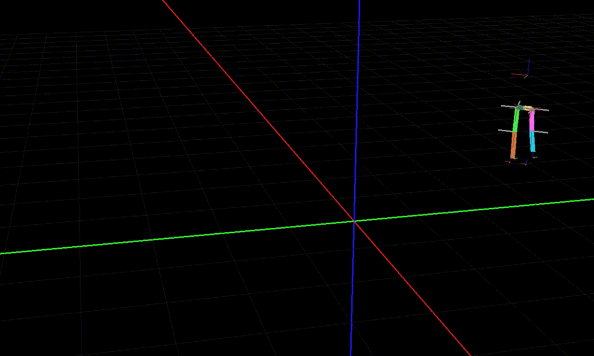

Simple Cyclic Coordinate Decent implementation for Panda3D
===========================================================
Numerical Inverse Kinematics solver with simple constraints





Features:
---------
- Hinge joints
- Ball joints
- Uses Panda3D's Bone system, so should be relatively easy to use with an existing skeleton. See usage notes below.
- Pure python, no dependencies beyond Panda3D

Not implemented:
----------------
- Other constraints
- Target rotation (only target position is currently taken into account)

Samples:
---------------
In all samples, use WASD to move and middle mouse button to rotate.

### Reacher Sample: ###

The Reacher sample shows how to set up a simple IK chain with constraints which reaches for a moving target point:

```
python3 ReacherSample.py
```

### Biped Sample: ###

The Biped sample shows a very basic humanoid, where the legs are placed by IK. The basic character setup is: The root is a "torso" node. To this, a hip node is rigidly attached. There are two legs, each is its own IKChain. To let the character walk, the torso node is moved, and everything else moves with it.
While the torso moves, the legs have target points on the ground. The IK makes sure that they stay attached to these points, even when the torso moves. Periodically, the legs are moved to a new target to take a step. This new target point is always a point projected onto the floor in front of the body. How often a step is taken and how far infront of the character the new target position is depends on the movement speed of the character.

```
python3 BipedSample.py
```

Press + and - to speed the character up or slow it down. Note that this is very simplified - the step length should likely be increased for higher speeds.

Usage notes:
------------
- Create a new IKChain, then create bones by calling "addBone".
- The "offset" parameter is a vector which describes the difference between the new bone's position and that of its parent. **Note that I only tested with offsets which are along the Y axis, i.e. are multiples of LVector3f.unitY().**
- The "rotAxis" can either be a (unit) vector, or "None". In the latter case, the constraint acts like that of a ball joint (or maybe more like two perpendicular hinge joints). In the former case, the rotAxis is the axis of the hinge joint. **Note that I only tested axis which are perpendicular to the "offset" vector, more specifically I usually use unitX or unitY.**
- After adding all bones, you must call "IKChain.finalize()".
- Call IKChain.setTarget and IKChain.updateIK to make the chain (try to) reach for a target.
- CCD tends to rotate the last segments (the ones close to the end effector) much more than those close to the root, which can be undesirable. To avoid this, an annealing strategy should be implemented, which weighs the movement of bones depending on their distance to the root.
- Ball joints (rotAxis=None) currently have no way of limiting a bone's "roll" angle. This means your bones may spin uncontrollably around their own axis.

Setting up mesh with bones:
---------------------------
- When exporting from blender, make sure there is a vertex group for every bone - even if it's empty (i.e. if you have a bone called "Bone.002" there must be a vertex group called "Bone.002"). Otherwise, the bone gets positioned at the model root by Panda3D, and offsets are no longer correct. Hint: in blender, these vertex groups are set up automatically when parenting an armature to the mesh and selecting the automatic weight assignment.
- Make sure every bone is connected to its predecessor.
